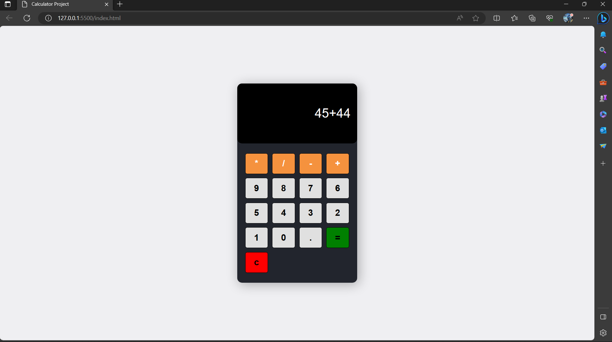

Sure, here's the README written in Markdown language:

```markdown
# Simple Calculator Project

This is a basic web-based calculator project implemented using HTML, CSS, and JavaScript. The calculator allows users to perform simple arithmetic calculations.



## Features

- Addition, subtraction, multiplication, and division operations
- Responsive design that adapts to different screen sizes
- User-friendly interface with clickable buttons

## Technologies Used

- HTML: The structure of the calculator and buttons.
- CSS: Styling and layout of the calculator interface.
- JavaScript: Handling user input, performing calculations, and updating the display.

## How to Use

1. Clone the repository or download the ZIP file:
   ```
   git clone https://github.com/Finally-Kwaku/simple-calculator.git
   ```

2. Navigate to the project directory:
   ```
   cd simple-calculator
   ```

3. Open the `index.html` file in your web browser.

4. The calculator interface will be displayed. You can perform the following actions:
   - Click on the number buttons to input digits.
   - Click on the operation buttons (+, -, *, /) to select the desired operation.
   - Click on the "=" button to calculate the result.
   - Click on the "C" button to clear the input and reset the calculator.

## Project Structure

- `index.html`: The main HTML file containing the structure of the calculator.
- `styles.css`: The CSS file containing the styling for the calculator.
- `script.js`: The JavaScript file containing the logic for user input and calculations.

## Contributing

Contributions are welcome! If you find any issues or want to enhance the calculator's functionality or design, feel free to open a pull request. Please make sure to follow the existing code style and guidelines.

## Authors

- Kwaku Gyamfi
- Wilbert Boadzo

